# 流程报装需求文档

> 此需求文档将流程分为工程类和审批类分别介绍：

**工程类：**

```
用水申请（支持批量）
```

**审批类：**

```
申请报停、申请销户、恢复用水、申请过户、阶梯人口调整、用户水价调整、申请验表、申请拆表、申请换表
```

[TOC]

## 审批类

### 1、申请报停

申请报停流程是对水表进行报停处理，更改水卡的用水状态为报停。

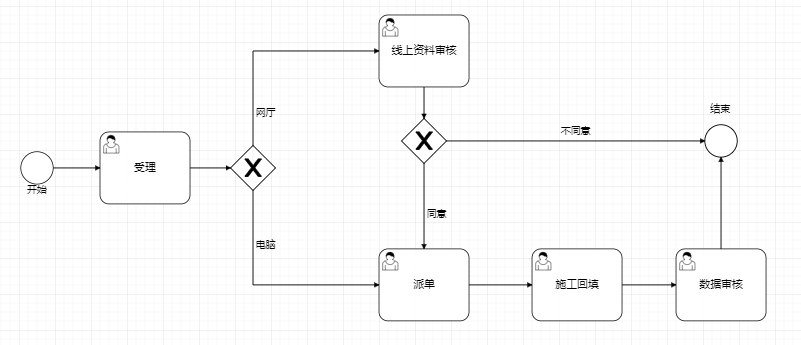

------

**申请表单分为三个模块：业主信息、水卡信息、办理信息**

- 卡号（输入水卡号进行搜索，回显出业主信息及水卡信息）
- 业主信息

```markdown
业主代码、业主名称、业主地址、证件类型、证件号码、手机号码、业主类型
```

- 水卡信息

```
表身号、用水地址、水表位置、用水状态、用水性质、本期行至、水表口径、欠费金额
```

- 办理信息（需要业务人员手动输入办理报停需要的信息）

```
经办人、经办人证件类型、经办人证件号码、经办人手机号码、申请原因、报停方式、附件管理
```

------

**施工回填表单分为四个模块：（业主信息、水卡信息、办理信息**）**+施工回填信息**

- *卡号*
- 业主信息

```markdown
业主代码、业主名称、业主地址、证件类型、证件号码、手机号码、业主类型
```

- 水卡信息

```
表身号、用水地址、水表位置、用水状态、用水性质、本期行至、水表口径、欠费金额
```

- 办理信息

```
经办人、经办人证件类型、经办人证件号码、经办人手机号码、报停方式、申请原因、备注、附件管理
```

- 施工回填（施工员到现场进行施工回填需要录入的信息）

```
施工员、拆表低度、拆表日期、施工图片（附件）、施工日志
```

------

线上资料审核、派单表单同受理节点；

------

数据审核同施工回填节点表单。

------


### 2、申请销户

申请销户流程的功能是对水表进行销户处理，更改水卡的用水状态为销户。


------

**申请表单分为三个模块：业主信息、水卡信息、办理信息**

- 卡号（输入水卡号进行搜索，回显出业主信息及水卡信息）
- 业主信息

```markdown
业主代码、业主名称、业主地址、证件类型、证件号码、手机号码、业主类型
```

- 水卡信息

```
表身号、用水地址、水表位置、用水状态、用水性质、本期行至、水表口径、欠费金额
```

- 办理信息（需要业务人员手动输入办理销户需要的信息）

```
经办人、经办人证件类型、经办人证件号码、经办人手机号码、销户原因（用户申请、内部申请）、申请原因、附件管理
```

------

**施工回填表单分为四个模块：（业主信息、水卡信息、办理信息**）**+施工回填信息**

- *卡号*
- 业主信息

```markdown
业主代码、业主名称、业主地址、证件类型、证件号码、手机号码、业主类型
```

- 水卡信息

```
表身号、用水地址、水表位置、用水状态、用水性质、本期行至、水表口径、欠费金额
```

- 办理信息

```
经办人、经办人证件类型、经办人证件号码、经办人手机号码、销户原因（用户申请、内部申请）、申请原因、附件管理
```

- 施工回填（施工员到现场进行施工回填需要录入的信息）

```
施工员、拆表低度、拆表日期、施工图片（附件）、施工日志
```

------

线上资料审核、派单表单同受理节点；

------

数据审核同施工回填节点表单。

------


### 3、恢复用水

恢复用水流程的功能是对状态为报停或者销户的水表进行恢复正常的处理，更改水卡的用水状态为正常。


------

**申请表单分为三个模块：业主信息、水卡信息、办理信息**

- 卡号（输入水卡号进行搜索，回显出业主信息及水卡信息）
- 业主信息

```markdown
业主代码、业主名称、业主地址、证件类型、证件号码、手机号码、业主类型
```

- 水卡信息

```
表身号、用水地址、水表位置、用水状态、用水性质、本期行至、水表口径、欠费金额
```

- 办理信息（需要业务人员手动输入办理恢复用水需要的信息）

```
经办人、经办人证件类型、经办人证件号码、经办人手机号码、申请原因、报停方式、附件管理
```

------

**施工回填表单分为四个模块：（业主信息、水卡信息、办理信息**）**+施工回填信息**

- *卡号*
- 业主信息

```markdown
业主代码、业主名称、业主地址、证件类型、证件号码、手机号码、业主类型
```

- 水卡信息

```
表身号、用水地址、水表位置、用水状态、用水性质、本期行至、水表口径、欠费金额
```

- 办理信息

```
经办人、经办人证件类型、经办人证件号码、经办人手机号码、申请原因、报停方式、附件管理
```

- 施工回填（施工员到现场进行施工回填需要录入的信息）

```
新表身号、新表起度、复接日期、施工员、施工图片（附件）、施工日志
```

线上资料审核、派单表单同受理节点；

------

数据审核同施工回填节点表单。

------


### 4、过户流程

过户流程就是把一个水表过户到另外一个业主名下（必须是已经存在的业主）。

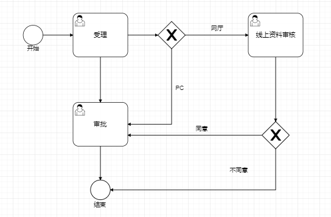

------

**申请表单分为三个模块：业主信息、水卡信息、办理信息**

- 卡号（输入水卡号进行搜索，回显出业主信息及水卡信息）
- 业主信息

```markdown
业主代码、业主名称、业主地址、证件类型、证件号码、手机号码、业主类型
```

- 水卡信息

```
表身号、用水地址、水表位置、用水状态、用水性质、本期行至、水表口径、欠费金额
```

- 新业主信息

```
新业主编号，输入新业主编号展现出新业主信息（业主代码、业主名称、业主地址、证件类型、证件号码、手机号码、业主类型）
```

- 办理信息（需要业务人员手动输入办理过户需要的信息）

```
经办人、经办人证件类型、经办人证件号码、经办人手机号码、申请原因、附件管理
```

------

线上资料审核、审批表单同受理节点；

------


### 5、阶梯人口调整

阶梯人口申请即增加或减少水表对应的人口数，会相应的根据算法对阶梯水量进行调整。


**申请表单分为三个模块：业主信息、水卡信息、办理信息**

- 卡号（输入水卡号进行搜索，回显出业主信息及水卡信息）
- 业主信息

```markdown
业主代码、业主名称、业主地址、证件类型、证件号码、手机号码、业主类型
```

- 水卡信息

```
表身号、用水地址、水表位置、用水状态、用水性质、本期行至、水表口径、欠费金额、所属行业
```

- 办理信息（需要业务人员手动输入办理过户需要的信息）

```
申请人口数、经办人、经办人证件类型、经办人证件号码、经办人手机号码、申请原因、附件管理
```

------

线上资料审核、审批表单同受理节点；

------


### 6、用户水价调整

用户水价调整即对水表用水性质进行调整。

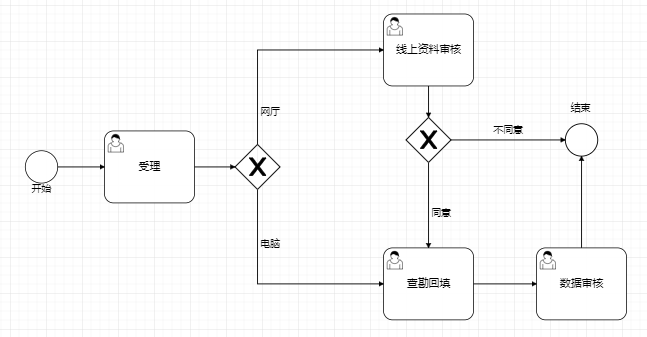

**申请表单分为三个模块：业主信息、水卡信息、办理信息**

- 卡号（输入水卡号进行搜索，回显出业主信息及水卡信息）
- 业主信息

```markdown
业主代码、业主名称、业主地址、证件类型、证件号码、手机号码、业主类型
```

- 水卡信息

```
表身号、用水地址、水表位置、用水状态、用水性质、本期行至、水表口径、欠费金额、所属行业
```

- 办理信息（需要业务人员手动输入办理变更水价需要的信息）

```
经办人、经办人证件类型、经办人证件号码、经办人手机号码、申请原因、附件管理
```

------

**查勘表单分为三个模块：业主信息、水卡信息、办理信息、查勘信息**

- 卡号
- 业主信息

```markdown
业主代码、业主名称、业主地址、证件类型、证件号码、手机号码、业主类型
```

- 水卡信息

```
表身号、用水地址、水表位置、用水状态、用水性质、本期行至、水表口径、欠费金额、所属行业
```

- 办理信息

```
经办人、经办人证件类型、经办人证件号码、经办人手机号码、申请原因、附件管理
```

- 查勘信息（这个查勘不同于施工的查勘，是对此次变更水价的一个情况确认）

```
新用水类别（参考下图以表单模式展开）、查勘人、查勘日期、查勘意见	
```

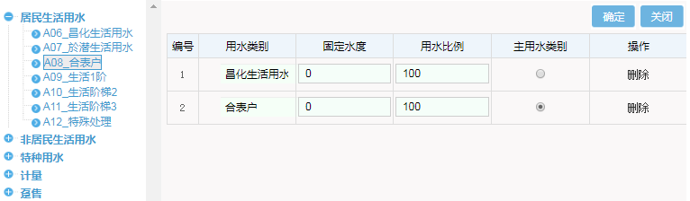


------

线上资料审核、数据审核表单同受理节点；

------


### 7、申请验表

对水表进行检验，通常是由于水表失准等原因导致的需要去现场查勘换表的操作流程。


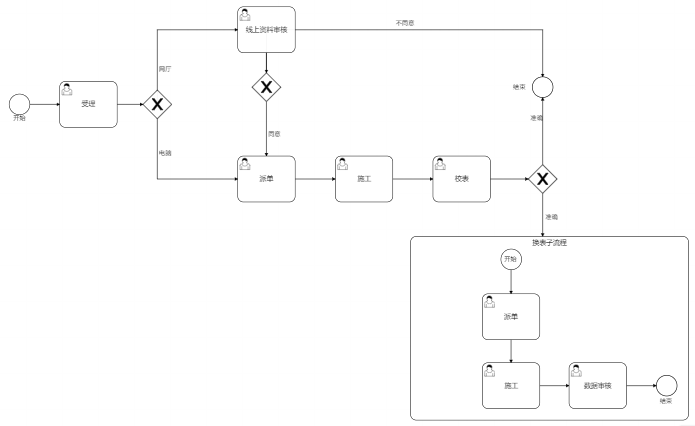

**申请表单分为三个模块：业主信息、水卡信息、办理信息**

- 卡号（输入水卡号进行搜索，回显出业主信息及水卡信息）
- 业主信息

```markdown
业主代码、业主名称、业主地址、证件类型、证件号码、手机号码、业主类型
```

- 水卡信息

```
表身号、用水地址、水表位置、用水状态、用水性质、本期行至、水表口径、欠费金额、所属行业
```

- 办理信息（需要业务人员手动输入办理过户需要的信息）

```
经办人、经办人证件类型、经办人证件号码、经办人手机号码、验表原因、附件管理
```

------

**施工分为四个模块：业主信息、水卡信息、办理信息+施工信息**

- 卡号
- 业主信息

```markdown
业主代码、业主名称、业主地址、证件类型、证件号码、手机号码、业主类型
```

- 水卡信息

```
表身号、用水地址、水表位置、用水状态、用水性质、本期行至、水表口径、欠费金额、所属行业
```

- 办理信息

```
经办人、经办人证件类型、经办人证件号码、经办人手机号码、验表原因、附件管理
```

- 施工（拆表）

```
施工员、拆表低度、拆表日期、施工图片（附件）、施工日志
```

------

**校表分为五个模块：业主信息、水卡信息、办理信息、施工信息+校表信息**

- 卡号
- 业主信息

```markdown
业主代码、业主名称、业主地址、证件类型、证件号码、手机号码、业主类型
```

- 水卡信息

```
表身号、用水地址、水表位置、用水状态、用水性质、本期行至、水表口径、欠费金额、所属行业
```

- 办理信息

```
经办人、经办人证件类型、经办人证件号码、经办人手机号码、验表原因、附件管理
```

- 施工（拆表）

```
施工员、拆表低度、拆表日期、施工图片（附件）、施工日志
```

- 校表（对施工员拆回的表进行校验检测得出结论）

```
校表结果（准确、不准确）、校表日期、校表备注
```

------

**施工（换表子流程）分为五个模块：业主信息、水卡信息、办理信息、施工（拆表）、校表+施工（换表子流程）**

- 卡号
- 业主信息

```markdown
业主代码、业主名称、业主地址、证件类型、证件号码、手机号码、业主类型
```

- 水卡信息

```
表身号、用水地址、水表位置、用水状态、用水性质、本期行至、水表口径、欠费金额、所属行业
```

- 办理信息

```
经办人、经办人证件类型、经办人证件号码、经办人手机号码、验表原因、附件管理
```

- 施工（拆表）

```
施工员、拆表低度、拆表日期、施工图片（附件）、施工日志
```

- 校表

```
校表结果（准确、不准确）、校表日期、校表备注
```

- 施工（换表子流程）到现场装新表

```
新表身号、新表起度、复接日期、施工员、施工图片（附件）、施工日志
```

------

线上资料审核、派单表单同受理节点

------

派单（换表子流程）表单同校表、数据审核（换表子流程）表单同施工（换表子流程）

------


### 8、拆表流程

拆表流程是对水表进行拆回并记录拆表低度、拆表日期等并更改水表状态。


**申请表单分为三个模块：业主信息、水卡信息、办理信息**

- 卡号（输入水卡号进行搜索，回显出业主信息及水卡信息）
- 业主信息

```markdown
业主代码、业主名称、业主地址、证件类型、证件号码、手机号码、业主类型
```

- 水卡信息

```
表身号、用水地址、水表位置、用水状态、用水性质、本期行至、水表口径、欠费金额
```

- 办理信息（需要业务人员手动输入办理销户需要的信息）

```
经办人、经办人证件类型、经办人证件号码、经办人手机号码、拆表原因、附件管理
```

------

**施工回填表单分为四个模块：（业主信息、水卡信息、办理信息**）**+施工回填信息**

- *卡号*
- 业主信息

```markdown
业主代码、业主名称、业主地址、证件类型、证件号码、手机号码、业主类型
```

- 水卡信息

```
表身号、用水地址、水表位置、用水状态、用水性质、本期行至、水表口径、欠费金额
```

- 办理信息

```
经办人、经办人证件类型、经办人证件号码、经办人手机号码、拆表原因、附件管理
```

- 施工回填（施工员到现场进行施工回填需要录入的信息）

```
施工员、拆表低度、拆表日期、施工图片（附件）、施工日志
```

------

线上资料审核、派单表单同受理节点；

------

数据审核同施工回填节点表单。

------


### 9、换表流程

换表流程是对水表进行更换的操作


**申请表单分为三个模块：业主信息、水卡信息、办理信息**

- 卡号（输入水卡号进行搜索，回显出业主信息及水卡信息）
- 业主信息

```markdown
业主代码、业主名称、业主地址、证件类型、证件号码、手机号码、业主类型
```

- 水卡信息

```
表身号、用水地址、水表位置、用水状态、用水性质、本期行至、水表口径、欠费金额
```

- 办理信息（需要业务人员手动输入办理销户需要的信息）

```
经办人、经办人证件类型、经办人证件号码、经办人手机号码、换表原因、附件管理
```

------

**施工回填表单分为四个模块：（业主信息、水卡信息、办理信息**）**+施工回填信息**

- *卡号*
- 业主信息

```markdown
业主代码、业主名称、业主地址、证件类型、证件号码、手机号码、业主类型
```

- 水卡信息

```
表身号、用水地址、水表位置、用水状态、用水性质、本期行至、水表口径、欠费金额
```

- 办理信息

```
经办人、经办人证件类型、经办人证件号码、经办人手机号码、换表原因、附件管理
```

- 施工回填（施工员到现场进行施工回填需要录入的信息）

```
换表日期、新表身号、旧表底度、新表底度、施工员、施工附件
```

------

线上资料审核、派单表单同受理节点；

------

数据审核同施工回填节点表单。

------


## 工程类

### 1、用水申请

用水申请工程报装是用户提出用水报装申请后供水公司对申请进行审核、查勘设计、工程备料、预算、施工、决算、建档、资料归档等一整套新（批量）装表的流程。

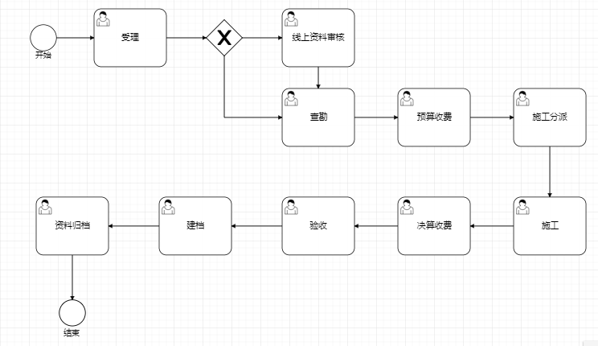

**1、申请表单（用水户根据用水需求到供水公司提出申请（提供基本位置等需求））**

```
  工程名称
  工程地址
  工程区域
  工程种类
  口径  
  证件类型
  证件号码
  联系人 
  备注
  附件资料
```

2、**查勘包含申请表单+（查勘信息，批表信息，工程备料）**

查勘信息：主要记录对此次工程的物理条件（比如是否有可供接入水源、是否有水表安装条件、接水地点现有管线情况、接水工程对周边用户影响情况）进行现场查验的结论。备注：可能多次查勘。

```
查勘日期、查勘人员、查勘项目、查勘结论、备注、查勘附件+列表（增删改）
```

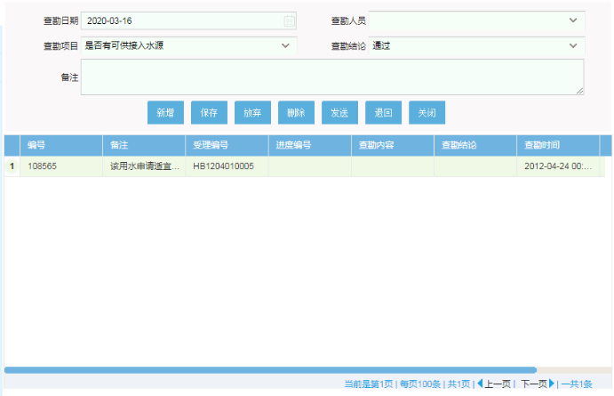

批表信息：录入此次工程需要的水表信息

```
口径、数量、用水类别、水表厂家、水表型号、水表类型、备注+列表（增删改）
```

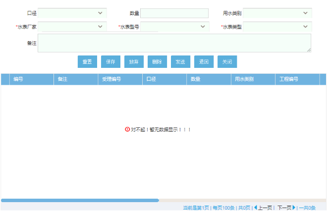

工程备料：录入此次工程所需的材料信息。

```
材料名称、材料代码、材料单位、材料单位、材料数量、备注+列表（增删改）		
```

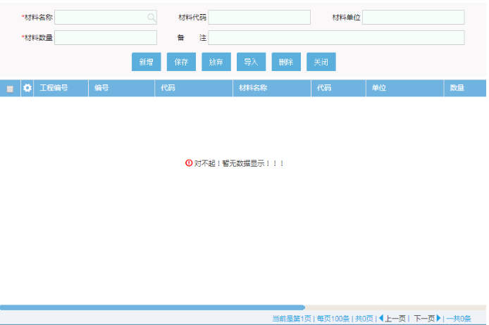

**3、预算收费包含申请表单、查勘信息、批表信息、工程备料+（工程预算）**

工程预算：通过对批表信息和备料信息预算出此次工程的费用。

```
设计编号（自动审查各行）、编制人员、预算金额、预算发包金额、总金额（根据预算金额和发包金额自动计算总金额）、备注
```

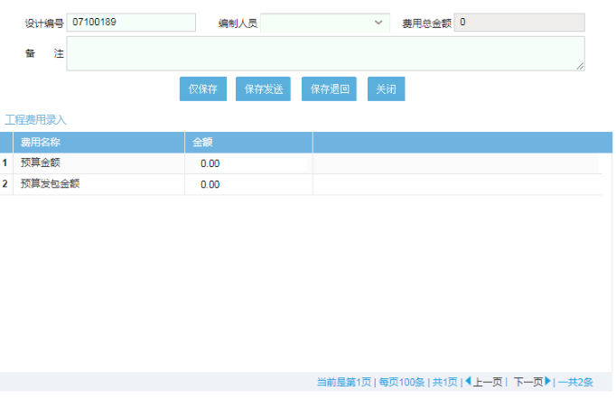

**4、施工分派（above forms）**

分派施工员到现场施工

**5、施工（above forms+施工信息、施工计划、用户档案表单）**

施工信息：施工员到现场对施工的情况描述

```
施工单位、施工编号（自动生成）、施工负责人、总数量、施工起始时间、施工结束时间、备注
```

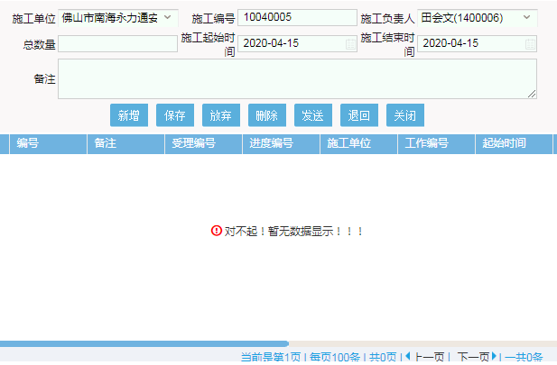


用户档案信息：新建水卡信息（支持批量）


手工挂表页面（新项目考虑简化操作）

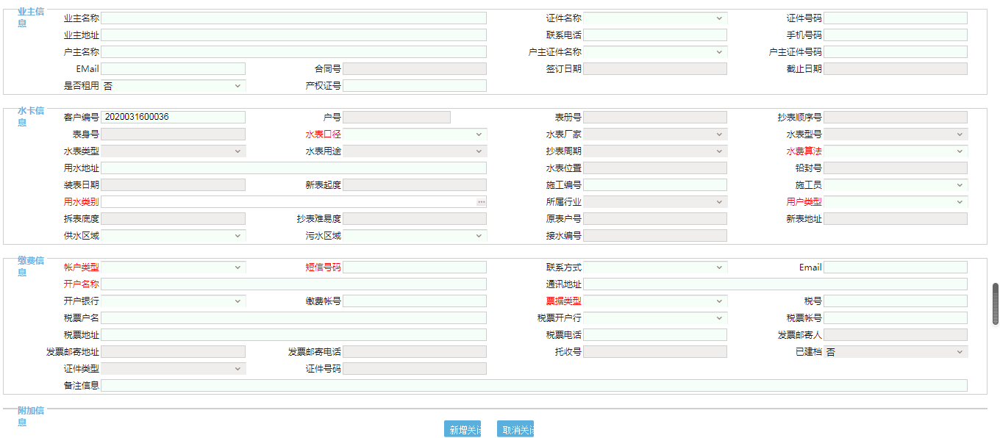

**6、决算收费（above forms+决算收费表单）**

对工程进行决算收费。

```
应收合计（自动计算）、收费日期（自动填充）、结算方式、实收金额、票据类型、备注
```


**7、验收（工程验收）**

对工程进行验收包含水表等项目的验收等。

```
验收部门、验收人员、施工编号、验收日期、验收项目、验收结论、备注
```

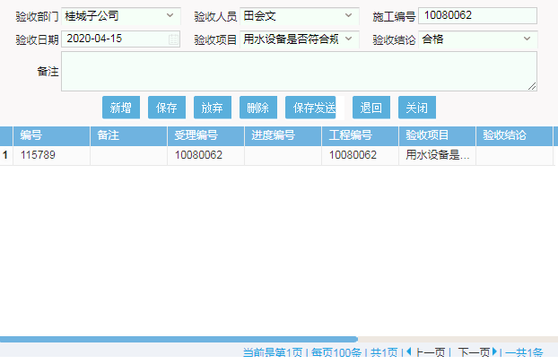

**8、建档**

对已经录入的水卡信息进行建档。


**9、资料归档**

