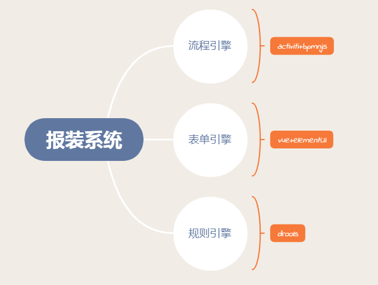
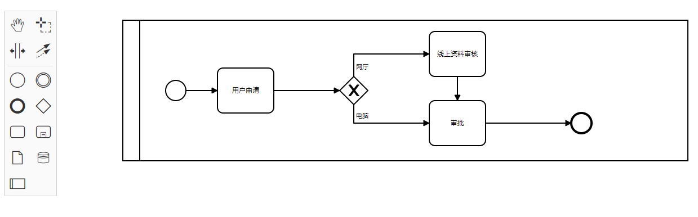
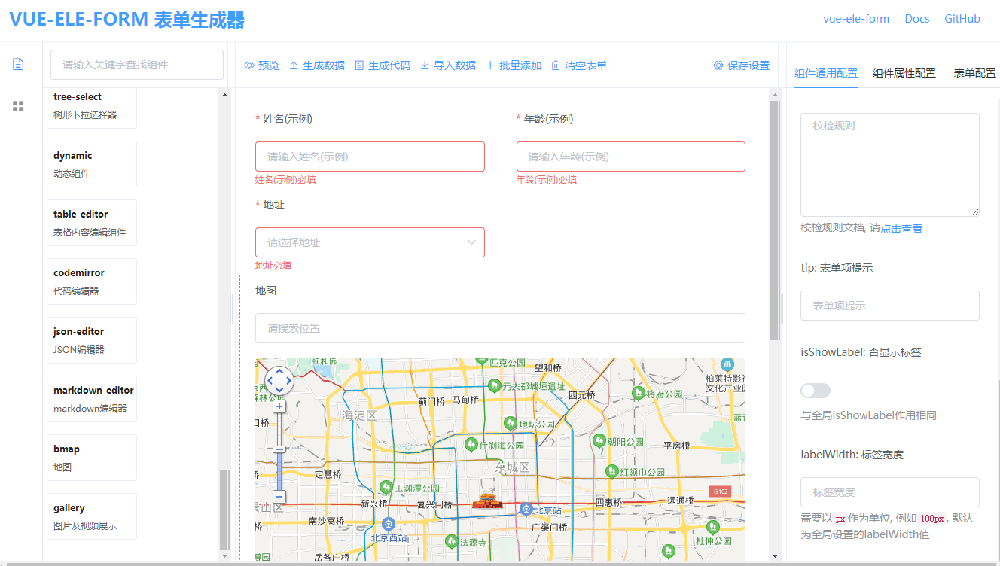

## 流程技术选型

流程图设计器https://github.com/bpmn-io/bpmn-js

表单拖拽设计器https://github.com/GavinZhuLei/vue-form-making

https://github.com/dream2023/vue-ele-form-generator

### Activiti整合规则引擎

 Drools是一款基于Java的开源规则引擎，实现了将业务决策从应用程序中抽离出来

 优点：

  ①简化系统架构哦，优化应用

  ②提高系统的可维护性和维护成本

  ③方便系统的整合

  ④减少编写“硬代码”业务规则的成本和风险

### 表单引擎

https://github.com/nijikokun/generate-schema Convert JSON Objects to MySQL子模块业务表单对应实体表单自动生成建表等语句

------

https://github.com/o1lab/xmysql One command to generate REST APIs for any MySql database业务表单rest APIs服务

## API Overview

| HTTP Type | API URL                                                      | Comments                                                     |
| --------- | ------------------------------------------------------------ | ------------------------------------------------------------ |
| GET       | /                                                            | Gets all REST APIs                                           |
| GET       | /api/tableName                                               | Lists rows of table                                          |
| POST      | /api/tableName                                               | Create a new row                                             |
| PUT       | /api/tableName                                               | Replaces existing row with new row                           |
| POST      | /api/tableName/bulk                                          | Create multiple rows - send object array in request body     |
| GET       | /api/tableName/bulk                                          | Lists multiple rows - /api/tableName/bulk?_ids=1,2,3         |
| DELETE    | /api/tableName/bulk                                          | Deletes multiple rows - /api/tableName/bulk?_ids=1,2,3       |
| GET       | /api/tableName/:id                                           | Retrieves a row by primary key                               |
| PATCH     | /api/tableName/:id                                           | Updates row element by primary key                           |
| DELETE    | /api/tableName/:id                                           | Delete a row by primary key                                  |
| GET       | /api/tableName/findOne                                       | Works as list but gets single record matching criteria       |
| GET       | /api/tableName/count                                         | Count number of rows in a table                              |
| GET       | /api/tableName/distinct                                      | Distinct row(s) in table - /api/tableName/distinct?_fields=col1 |
| GET       | /api/tableName/:id/exists                                    | True or false whether a row exists or not                    |
| GET       | [/api/parentTable/:id/childTable](https://github.com/o1lab/xmysql#relational-tables) | Get list of child table rows with parent table foreign key   |
| GET       | [/api/tableName/aggregate](https://github.com/o1lab/xmysql#aggregate-functions) | Aggregate results of numeric column(s)                       |
| GET       | [/api/tableName/groupby](https://github.com/o1lab/xmysql#group-by-having-as-api) | Group by results of column(s)                                |
| GET       | [/api/tableName/ugroupby](https://github.com/o1lab/xmysql#union-of-multiple-group-by-statements) | Multiple group by results using one call                     |
| GET       | [/api/tableName/chart](https://github.com/o1lab/xmysql#chart) | Numeric column distribution based on (min,max,step) or(step array) or (automagic) |
| GET       | [/api/tableName/autochart](https://github.com/o1lab/xmysql#autochart) | Same as Chart but identifies which are numeric column automatically - gift for lazy while prototyping |
| GET       | [/api/xjoin](https://github.com/o1lab/xmysql#xjoin)          | handles join                                                 |
| GET       | [/dynamic](https://github.com/o1lab/xmysql#run-dynamic-queries) | execute dynamic mysql statements with params                 |
| GET       | [/upload](https://github.com/o1lab/xmysql#upload-single-file) | upload single file                                           |
| GET       | [/uploads](https://github.com/o1lab/xmysql#upload-multiple-files) | upload multiple files                                        |
| GET       | [/download](https://github.com/o1lab/xmysql#download-file)   | download a file                                              |
| GET       | /api/tableName/describe                                      | describe each table for its columns                          |
| GET       | /api/tables                                                  | get all tables in database                                   |
| GET       | [/_health](https://github.com/o1lab/xmysql#health)           | gets health of process and mysql -- details query params for more details |
| GET       | [/_version](https://github.com/o1lab/xmysql#version)         | gets version of Xmysql, mysql, node                          |