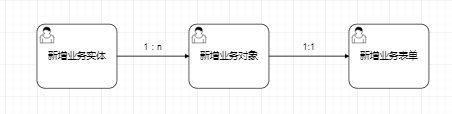

[TOC]

### 流程报装模块组成

### 新老报装功能点对照表

|                           item                           |    老报装    |   新报装    |
| :------------------------------------------------------: | :----------: | :---------: |
|               [表单设计器](#1、表单设计器)               |      无      | FormMaking  |
|                         流程引擎                         | 公司自己实现 | flowable6.5 |
|                 [模型版本](#2、模型版本)                 |      无      |     有      |
|                   [子流程](#3、子流程)                   |      无      |     有      |
|             [模型校验功能](#4、模型校验功能)             |      无      |     有      |
|                   [热力图](#5、热力图)                   |      无      |     有      |
|             [模型一键运行](#6、模型一键运行)             |      无      |     有      |
|                 [节点按钮](#7、节点按钮)                 |      无      |     有      |
| [节点人员配置支持脚本获取](#8、节点人员配置支持脚本获取) |      无      |     有      |
|                 [驳回策略](9、驳回策略)                  |      无      |     有      |
|                    [加签](#10、加签)                     |      无      |     有      |
|                    [委托](#11、委托)                     |      无      |     有      |
|       [流程事件同步/异步](#12、流程事件同步/异步)        |      无      |     有      |
|                [自动审批](#13、自动审批)                 |      无      |     有      |
|          [分支条件配置器](#14、分支条件配置器)           |      无      |     有      |
|        [在线配置流程图标](#15、在线配置流程图标)         |      无      |     有      |

### 附录功能点：

##### 1、表单设计器

​     表单设计器https://github.com/GavinZhuLei/vue-form-making

##### 2、模型版本

​		BPMN并没有版本的概念。这其实很好，因为可执行的BPMN流程文件很可能已经作为开发项目的一部分，保存在版本管理系统仓库中了（例如Subversion，Git，或者Mercurial）。但是，作为部署过程的一部分，引擎会创建流程定义的版本。在部署时，Flowable会在保存至Flowable数据库前，为`ProcessDefinition`指定版本。

>  http://www.shareniu.com/flowable6.5_zh_document/bpm/index.html#versioningOfProcessDefinitions
>
> 引用于Flowable BPMN 用户手册 (v 6.5.0-SNAPSHOT)  

优点：开发运维过程中可能会对流程图反复设计，有了版本管理流程图就不会担心丢失，如果新设计的流程图有问题可以很快回滚到上个版本，且以后如果产品成熟公司可以有个模型库，比如版本管理->苏州、杭州、长沙等等各个地市分支在现场实施的时候可以直接选取使用或者在给客户调研需求时直接展示。

##### 3、子流程

>http://www.shareniu.com/flowable6.5_zh_document/bpm/index.html#bpmnSubprocessAndCallActivity
>
>引用于Flowable BPMN 用户手册 (v 6.5.0-SNAPSHOT)  

##### 4、模型校验功能

模型校验效果如下图所示：

模型校验按钮点击之后，画布会显示并罗列所有出问题的节点。红色的代表有错误信息，黄色的代表有警告信息，⚠️信息不等价于❌信息。

##### 5、热力图

##### 6、模型一键运行

一键运行功能效果如下图所示：

点击一键运行按钮之后，该弹出框会完整的显示实例执行的信息，如果最后一条日志为结束节点，则表示该模型没有问题，可以正常启动和结束；否则代表该实例会卡在某个节点处。比如网关或者活动节点处的出线不满足条件时，会出线这种情况。盘古对应的表会记录模拟实例的详细信息，包括异常信息和运转信息。

> 关于模型校验与一键模拟运行的区别：
>
> 1. 模型校验为纯前段技术，一键模拟为后台技术。
> 2. 模型校验可以图形化方式显示模型中元素的错误或者警告信息，需要人工去逐个排查。一键模拟可以很直观的看出来当前的模型实际运转轨迹。
> 3. 模型校验和一键模拟策略均可以按需定制。
> 4. 模型校验更侧重于BPM2.0标准以及业务校验，一键模拟更侧重于流程的执行结果。

##### 7、节点按钮

##### 8、节点人员配置支持脚本获取

以几个维度供操作人员选择：指定用户、角色、部门除此之外优点还可以通过自定义的脚本去设置权限，比如说通过户号获取对应的抄表员进行审批。

##### 9、驳回策略

审批期限：工作日/自然日

驳回&退回策略：

##### 10、加签

##### 11、委托

委托人在生效期间会代理被委托人处理单据。

##### 12、流程事件同步/异步

​	配置节点事件时在每个选择的事件都增加类型可供选择

**13、自动审批**

​      节点属性增加自动审批策略，比如指定时间没审批就自动审批。

##### 14、分支条件配置器

点击查看表达式获取JUEL表达式

> 优点：在实际项目实施过程中流程流转出错大部分原因都是分支条件设置有误，比如中英文字母大小写、变量值拼错，使用这种方式可以从根本上杜绝这类问题的发生，且老报装系统中需要设置全局变量，实施过程中经常出现忘记配置全局变量就在分之条件中使用的情况，新系统去除全局变量的设置，flowable引擎将表单参数映射至流程变量，默认可选取表单中所有的字段（如下图）。

##### 15、在线配置流程图标

新增或编辑时在线选择流程图标

### 流程配置过程

1、通过流程设计器根据业务绘制出流程图

2、分析流程图需要哪些业务表单，通过表单设计器设计出每个业务的表单（[表单设计过程](#附录2：表单设计过程)）；

3、配置节点表单

4、配置节点事件

5、配置节点人员

6、配置节点按钮

7、配置节点属性

##### 附录2：表单设计过程

新报装将一个表单（申请、处理界面）模块化，一个表单分为多个子表单。这样可以更方便地快速设计一个表单，为了后期更好的分析数据每个流程设计业务的模块均以新增表的方式实现，比如换表会对应两个业务表tb拆表、tb换表，这样做的好处是解耦每个流程公用一个字段的耦合性（sys_flow_data /formdata字段）。

先了解一下表单抽象出来的三个概念：

- 业务实体：业务实体的含义就是直接与数据库业务表对应的vo，它存在的意义是可以解耦与业务无关的表单字段及模块化整个表单的组成。业务实体可以直接在线输入字段提交自动建表，也可选择已存在的表进行字段选择。
- 业务对象：可以理解为是对多个业务实体的一个整合，业务对象的职责就是通过整合业务实体描绘出一个表单，当然在程序层面的表现就是对表单的数据结构进行设计。业务对象就是表单的数据结构（json）。
- 表单设计：新增一个表单要选择一个业务对象，选择完业务对象一个表单的主要业务数据结构就确定了，当然也可以可视化拖拽添加其他与业务无关的字段，也可以对业务字段进行位置排序移动。

所以新建一个表单的过程是

> 备注：
>
> 业务实体是与数据库业务表1：1的对应关系，可以根据业务字段在线建表或者直接load已经建好的业务表；
>
> 业务对象与业务实体是1：n的对应关系，一个业务对象是对一个业务结构的描述，比如换表要先拆表后换表，那这个业务对象就有两个业务实体拆表和换表；
>
> 业务表单与业务对象是1：1的对应关系，业务表单是业务对象的直接与用户接触的表达方式，前端通过解析业务对象的json数据结构通过页面的方式展示出来。

