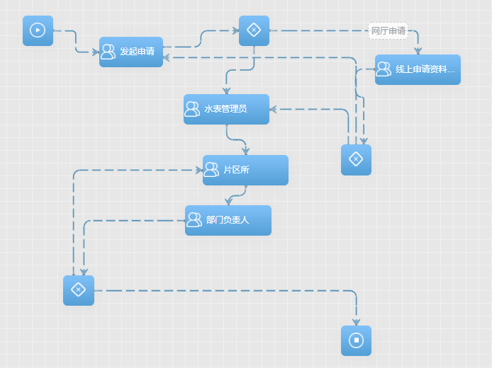
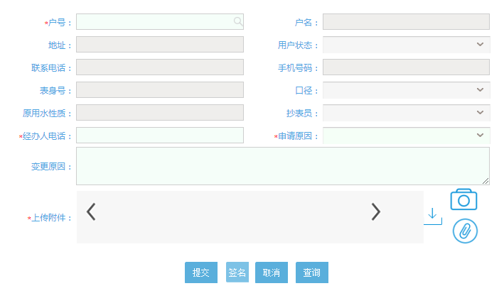
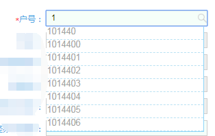
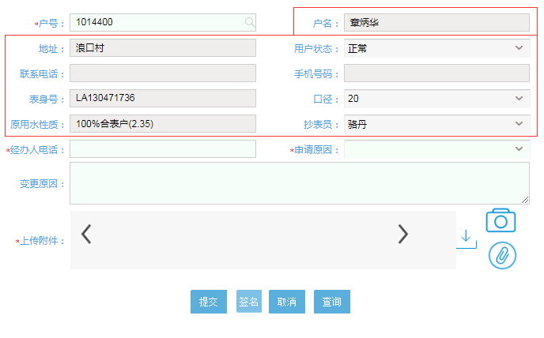
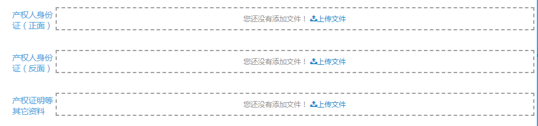
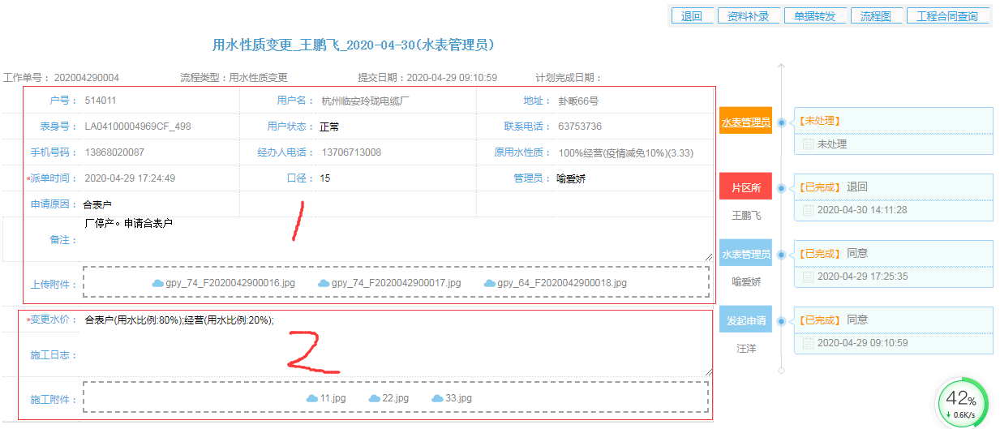
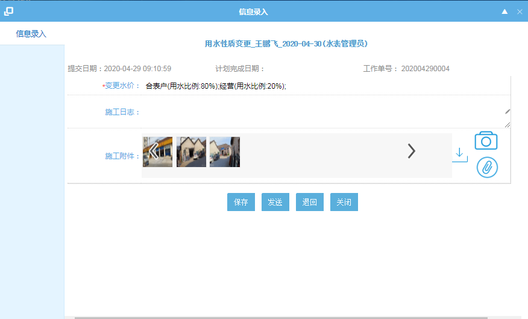
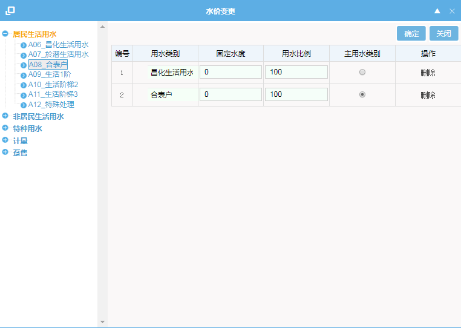
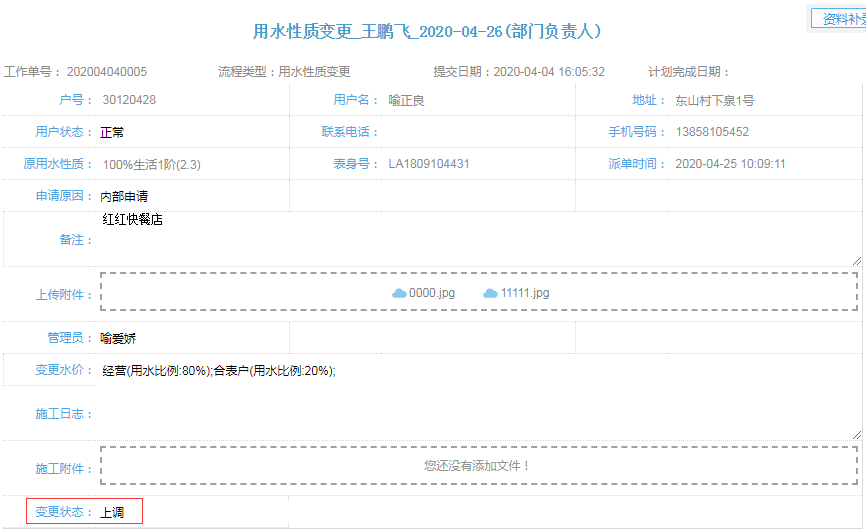

## 用水性质变更示例

|     流程名称     |                     用水性质（水价）变更                     |
| :--------------: | :----------------------------------------------------------: |
| 启动者（发起者） |                  水司前台、微网厅、表务APP                   |
|      参与者      |      前台人员、水表管理员、片区所（表务科）、部门负责人      |
|       过程       | 水司人员通过PC或用户通过微网厅提交用水性质（水价）变更流程，水司人员审核资料、变更水价、通过审核后将新用水性质回写到mis系统中。 |

### 1、流程图

流程图节点概述：

|     节点     |                            描述                            |
| :----------: | :--------------------------------------------------------: |
| 线上资料审核 | 审核由微网厅提交的单据，初审通过后才会流转到水表管理员节点 |
|  水表管理员  |      到现场查勘施工是否符合变更水价条件并录入变更水价      |
|    片区所    |   对水表管理员变更后的水价进行定性（上调、合表户、下调）   |
|  部门负责人  |         对单据确认，审批同意后变更新水价到营收系统         |

特别要求：

1、水表管理员节点配置了很多处理人员，但是要求单据提交后只流转到该户号的水卡管理员，该单据在水表管理员节点不对其他人员有可见性。（工作流引擎术语应该叫做动态配置节点人员）

2、线上资料审核通过与否都要给用户发送短信、单据办结也要发送短信

### 2、节点

#### 2.1  发起申请

申请表单主要包含水卡信息和此次办理需要填写的信息。

其中户号有智能搜索功能，比如输入1会自动检索1开头的水卡号

选择自动检索出的户号或者回车可以会联动出与户名等相关的信息

手机号要检验是否是正确的手机号；

申请原因：下拉字典，包含合表户、用户申请、内部申请、其他；

上传附件：包含三种附件，产权人身份证（正面）、产权人身份证（反面）、产权证明等其它资料

#### 2.2  线上资料审核

节点属于审批类型，表单同申请节点，审批不同意则退回到申请节点，如果同意则流转到水表管理员节点

#### 2.3  水表管理员

水表管理员表单包含两个部分，第一部分是申请表单的内容，第二部分是水表管理员要去填写的部分

   点击右侧时间柱“水表管理员”按钮弹出信息录入页面

变更水价：类型为子表单，双击弹出变更水价表单如下图

选择水价后点击确定后关闭弹窗，将选择的水价回填到变更水价字段

施工附件：为附件上传类，可上传多张图片

#### 2.4  片区所

在以上节点表单基础上只增加一个字段：

变更状态：下拉字典选择框类型，包含：上调、合表户、下调

#### 2.5  部分负责人

表单无新增字段，同片区所。

节点属于审批类型，直接处理发送即可，如果不同意则退回到片区所，同意则流程结束并调用变更水价流程事件将新水价变更到mis营收系统中。