### 

# 新报装通用需求（确定的节点）

参考流程图1：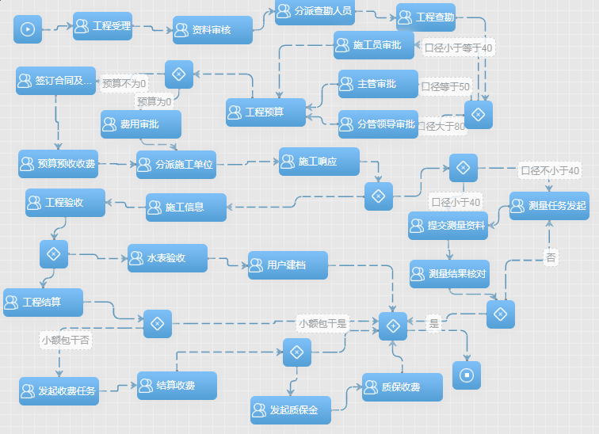

流程图2：

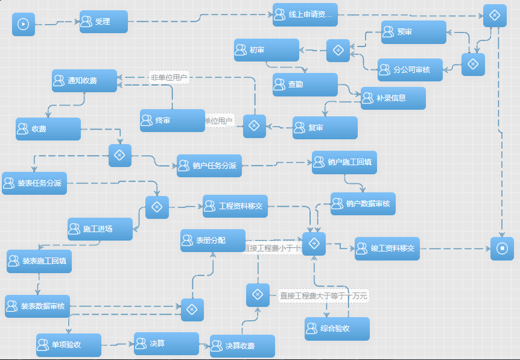

## 1、受理

用水户根据用水需求到供水公司提出申请（提供基本位置等需求）。

| 列名     |
| -------- |
| 工程地址 |
| 工程区域 |
| 口径     |
| 证件类型 |
| 证件号码 |
| 联系人   |
| 附件资料 |

受理ed1:

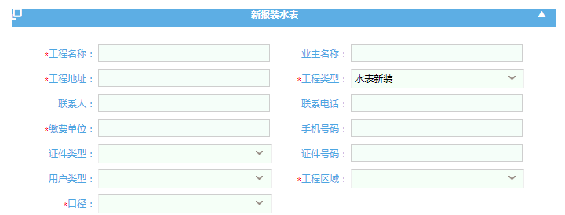

## 2、查勘（查勘信息、批表、工程备料）

- [ ] ### 查勘信息:

主要记录对此次工程的物理条件（比如是否有可供接入水源、是否有水表安装条件、接水地点现有管线情况、接水工程对周边用户影响情况）进行现场查验的结论。

查勘ed1:

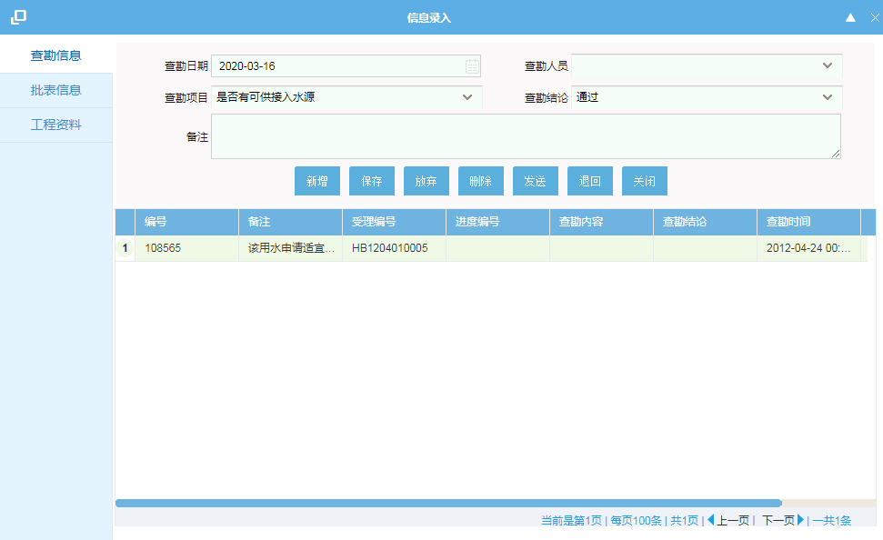

查勘ed2:

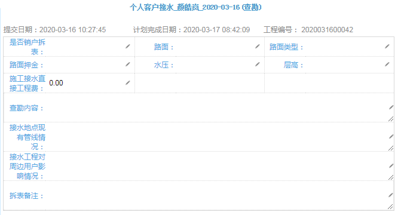

- [ ] ### 批表

  录入此次工程需要的水表信息

  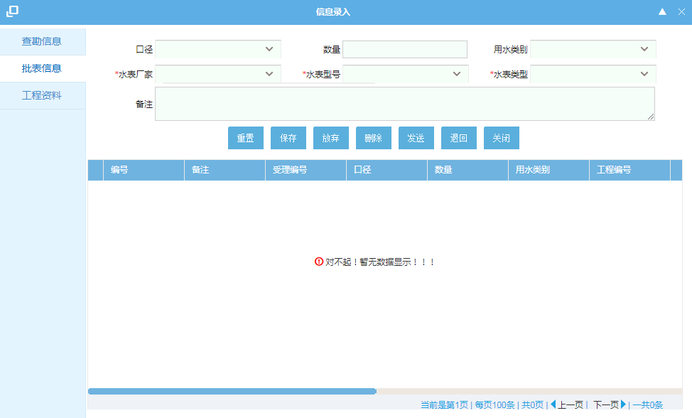

- [ ] ### 工程备料

  录入此次工程所需的材料信息。

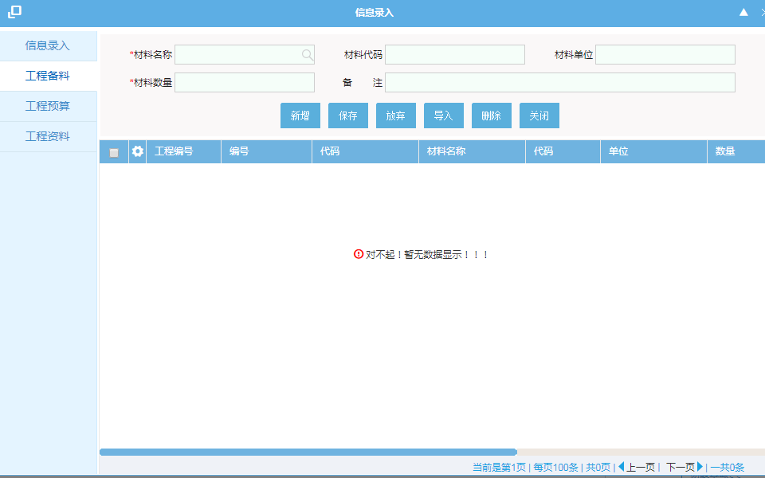

3、预算收费（工程备料、工程预算、工程收费）

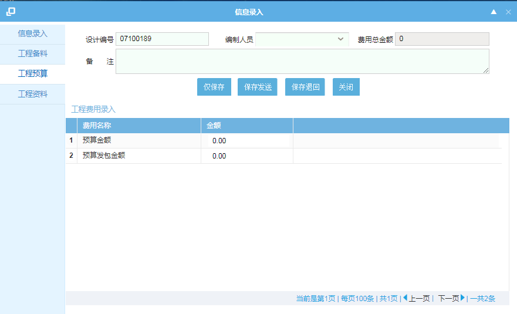

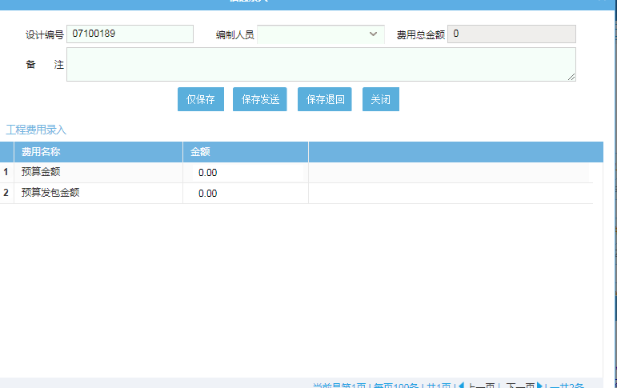

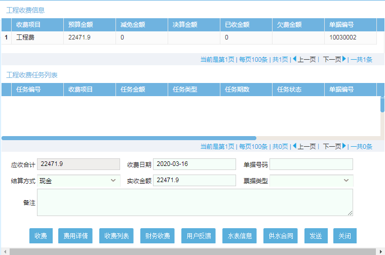

4、施工分派

5、施工（施工信息、施工日志、施工计划、用户档案表单）

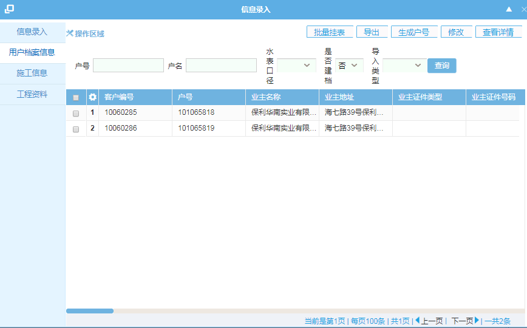

手工挂表：

6、决算收费

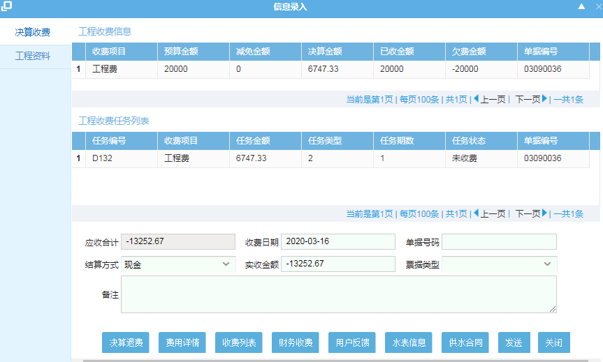

7、验收（工程验收、水表验收）

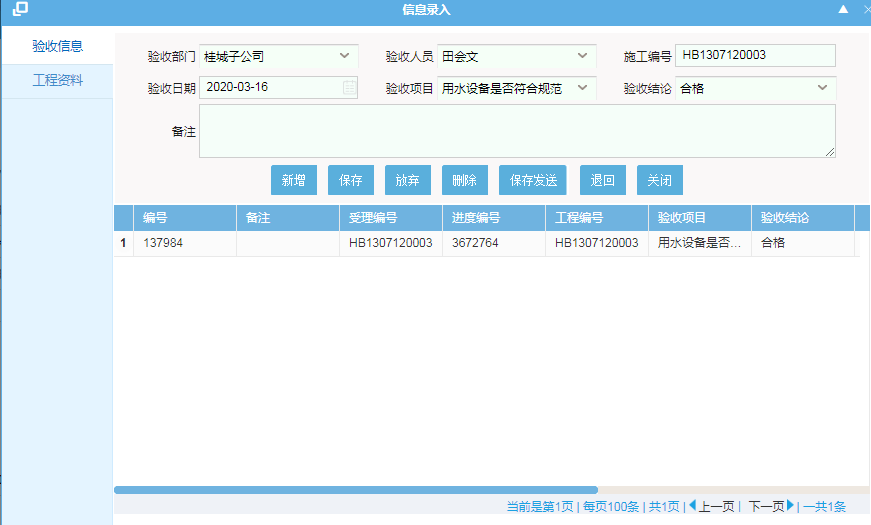

8、建档

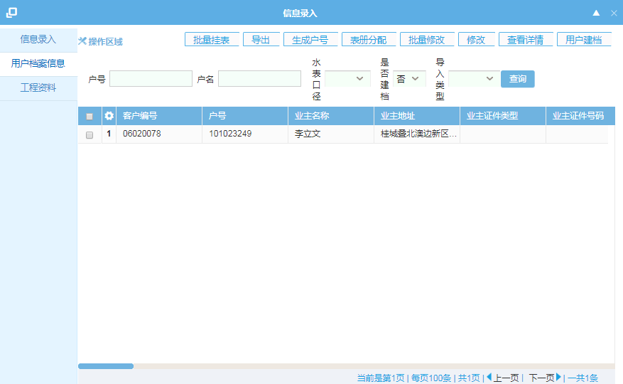

9、资料归档

## 审批类流程

审批类通常都是:

纯审批类的：

申请->线上资料审核->审批->结束

涉及施工类的

申请->线上资料审核->审批->派单->施工->结束

其中水价变更（用水性质变更会涉及表单嵌套表单）

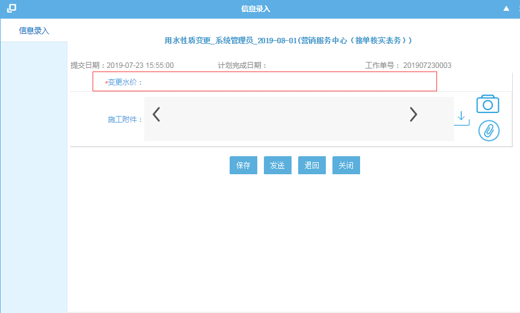

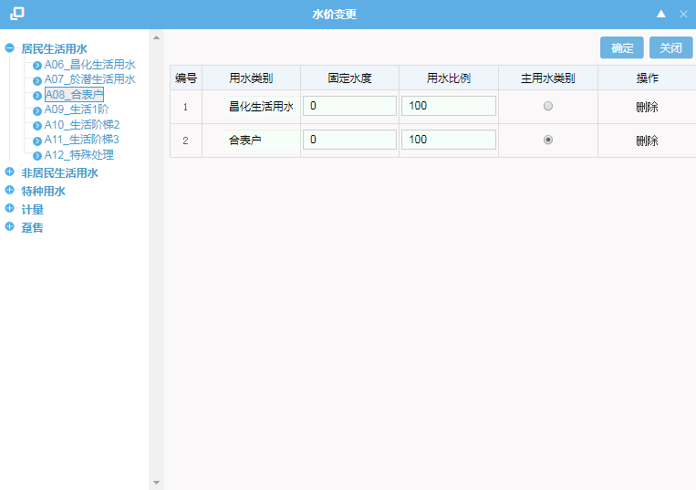